#b 
 UNOScoreKeepe App
Project which comes under Udacity Android Basics Nanodegree Program

# Project Overview
This project is a chance for you to combine and practice everything you learned in this section of the Nanodegree program.
 You will be making an app that allows a user to keep track of points within a game.

The goal is to create an Score Keeper app which gives a user the ability to keep track of the score of two different teams playing a game of your choice.
To build this project, you can follow along with the practice set and customize the Court Counter app to track scores from a different sport.

# Requirement
1. Game Chosen
2. App is divided into two columns, one for each team.
3. Two or more other pieces of information, such as:
    a) Column contents
    b) Score buttons
    c) Reset button

## Final Output - Screenshots

English                         | Arabic
:--------------------------------:|:--------------------------------:
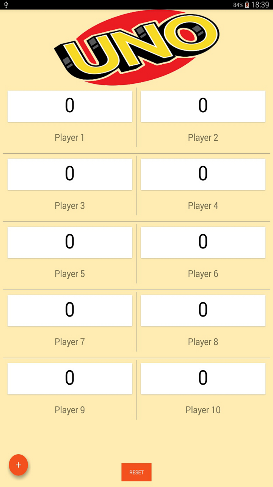  |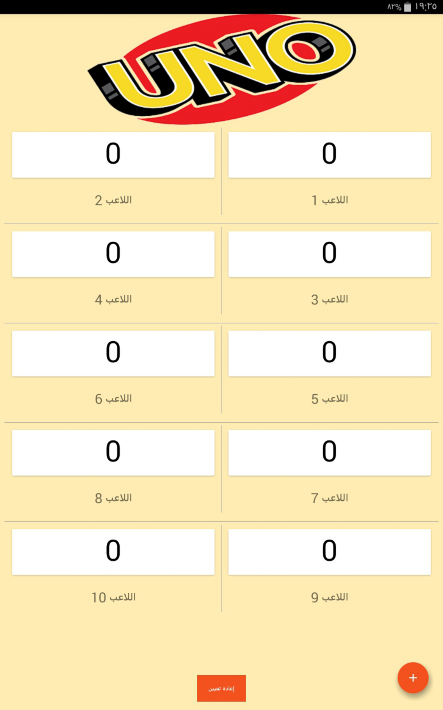
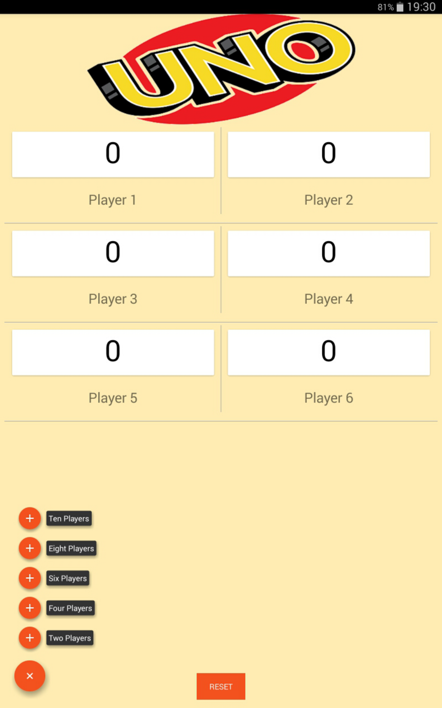  |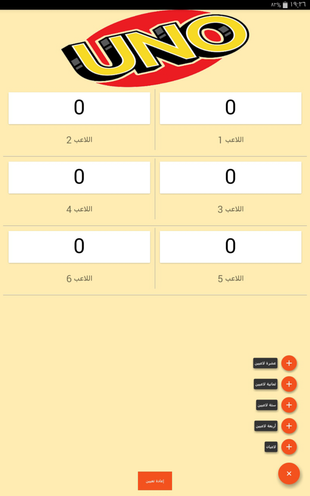
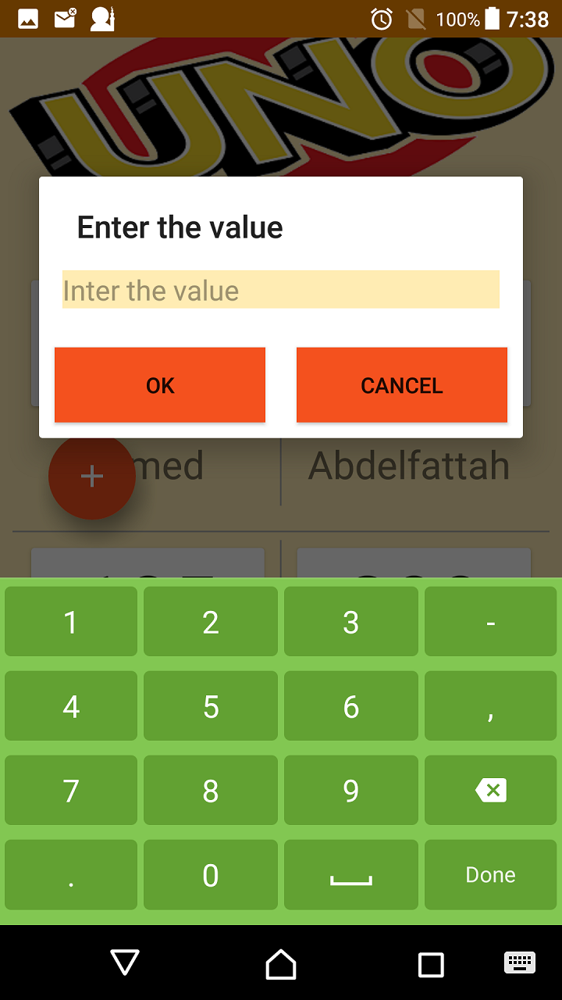  |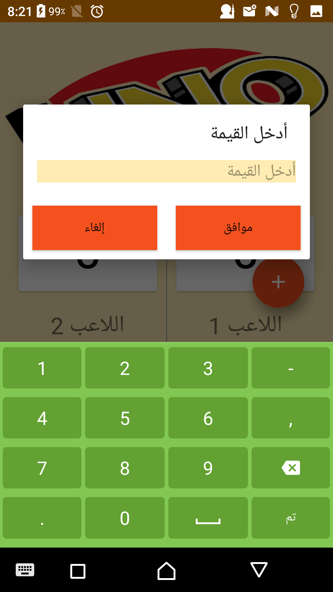
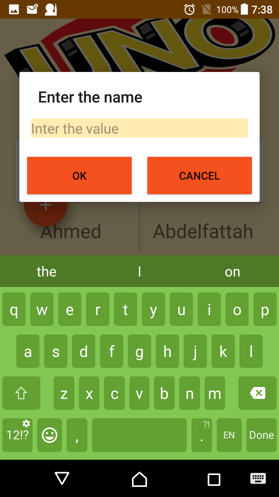  |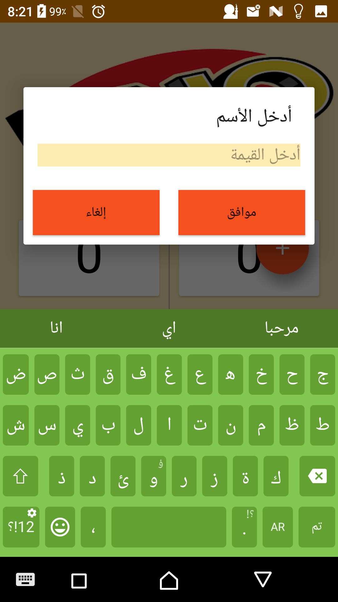
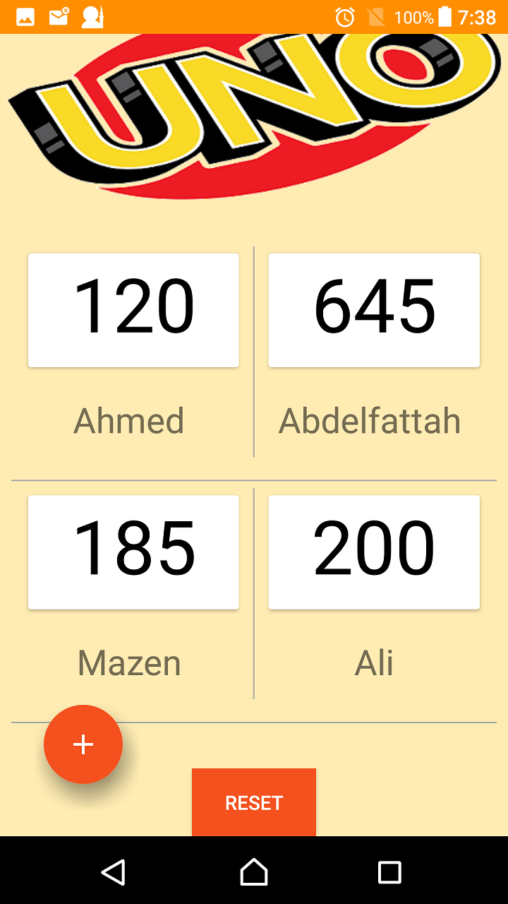  |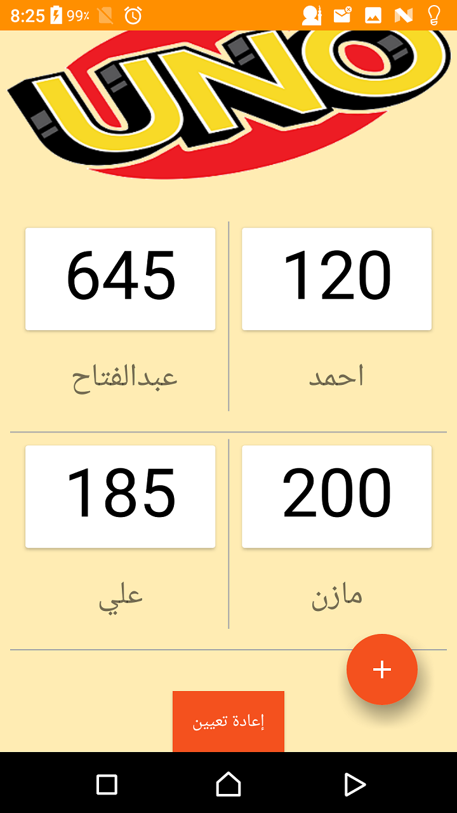
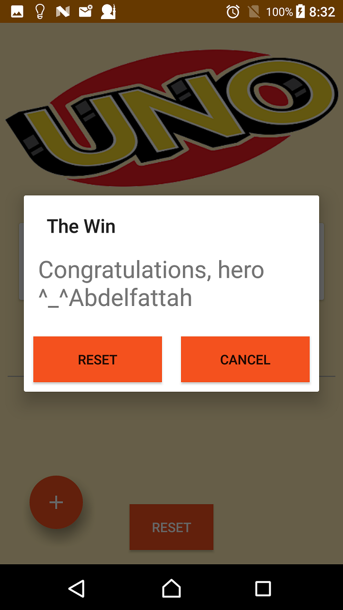  |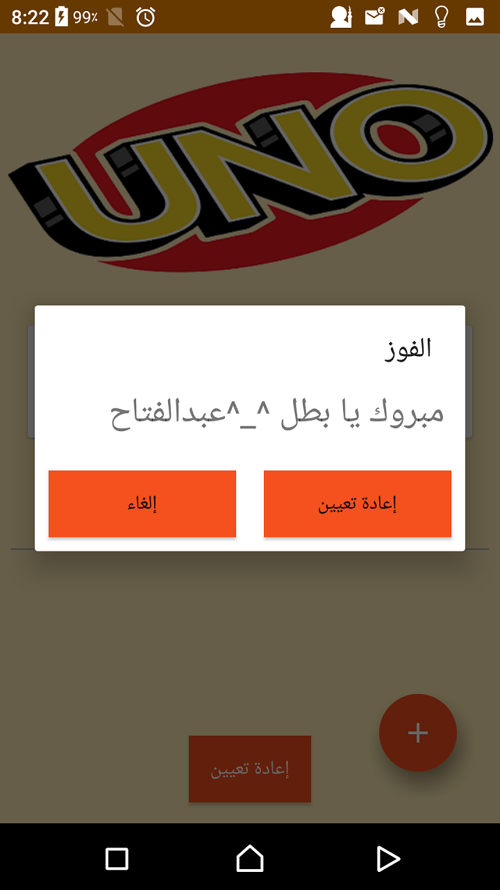

# Download
You can download the apk here [SingleScreenApp](../../raw/master/app/screenshots/app-debug.apk)
